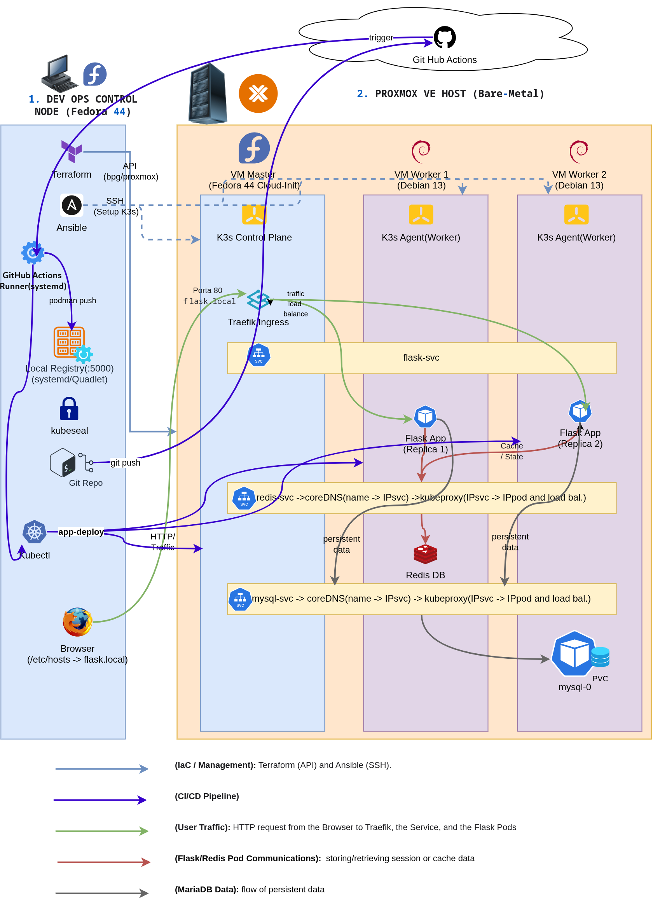

# Automated Kubernetes Cluster on Proxmox with Terraform & Ansible

This project implements a fully automated, GitOps-driven infrastructure pipeline to provision a multi-node Kubernetes cluster on Proxmox VE. It features a 3-tier containerized application (Flask + Redis + MariaDB) with persistent storage, encrypted secrets, automated CI/CD, and full observability.

## Architecture

The entire infrastructure is managed from a Fedora Linux control node, which provisions a K3s cluster on a remote Proxmox VE hypervisor, serves container images via a persistent local registry, and orchestrates deployments via GitOps.



- **Control Node (Workstation):** Fedora Linux. Acts as the DevOps control plane. It requires a **Static LAN IP** to ensure cluster components can reliably reach the registry and runner. It runs Terraform, Ansible, `kubectl`, and manages persistent background services via `systemd` and Podman Quadlet.
- **Hypervisor:** Proxmox VE (Bare-metal server on the same LAN, 12GB RAM).
- **Kubernetes Cluster (K3s):**
  - 1x Master Node (Fedora Cloud Image) - Runs Traefik Ingress Controller.
  - 2x Worker Nodes (Debian 12 Cloud Images).

## Tech Stack
- **Infrastructure Provisioning:** Terraform (`bpg/proxmox` provider) with Cloud-Init.
- **Configuration Management:** Ansible.
- **Container Orchestration:** K3s (Lightweight Kubernetes, CNCF Certified).
- **Containerization:** Podman.
- **CI/CD & GitOps:** GitHub Actions (Self-Hosted Runner).
- **Storage & Security:** PersistentVolumeClaims (PVC), StatefulSets, Kubernetes RBAC, Bitnami Sealed Secrets, Podman Named Volumes.
- **Observability:** Prometheus, Grafana, Node Exporter (via Helm).
- **Application:** Python (Flask) + Redis + MariaDB.

## Project Structure
```text
.
├── .github/workflows/ # CI/CD pipeline (GitHub Actions)
├── 1_terraform/       # Proxmox VM provisioning using Cloud-Init
├── 2_ansible/         # K3s installation, registry config, and RBAC
├── 3_kubernetes/      # Kubernetes manifests (Deployments, StatefulSets, PVC, Ingress)
├── app/               # 3-tier Flask application source code & Dockerfile
├── docs/              # Architecture diagram
└── README.md
```

## Quick Start / Reproduction

### Prerequisites
- A Proxmox VE instance with API tokens enabled.
- Cloud-Init templates created on Proxmox (Fedora and Debian).
- Terraform, Ansible, Podman, Helm, and kubectl installed on your control node.

### Step 1: Infrastructure Provisioning (Terraform)
1. Navigate to the `1_terraform/` directory.
2. Create a `terraform.tfvars` file based on `terraform.tfvars.example` and fill it with your Proxmox API token, SSH key, and network details.
3. Run the following commands:
   ```bash
   terraform init
   terraform apply -auto-approve
   ```

### Step 2: Cluster Configuration (Ansible)
1. Navigate to the `2_ansible/` directory.
2. Create an `inventory.ini` file based on `inventory.ini.example` using the IPs outputted by Terraform.
3. Run the K3s setup and local registry configuration playbooks:
   ```bash
   ansible-playbook -i inventory.ini k3s-setup.yml
   ansible-playbook -i inventory.ini registry-setup.yml
   ```

### Step 3: Control Node Preparation (Static IP & Systemd Services)
To ensure the CI/CD pipeline and image registry are always available and persistent, the Fedora control node must be configured properly.

1. **Set Static LAN IP:** The local registry and K3s nodes rely on a fixed IP. Use `nmcli` to configure your network connection (replace `<CONNECTION_NAME>`, `<STATIC_IP>`, and `<GATEWAY_IP>` with your actual network values):
   ```bash
   # Find your connection name
   nmcli connection show
   
   # Configure static IP, gateway, and DNS
   sudo nmcli connection modify '<CONNECTION_NAME>' ipv4.addresses <STATIC_IP>/24
   sudo nmcli connection modify '<CONNECTION_NAME>' ipv4.gateway <GATEWAY_IP>
   sudo nmcli connection modify '<CONNECTION_NAME>' ipv4.dns "<GATEWAY_IP>"
   sudo nmcli connection modify '<CONNECTION_NAME>' ipv4.method manual
   sudo nmcli connection up '<CONNECTION_NAME>'
   ```

2. **Local Registry (Persistent Podman Quadlet):** Create the local directory for the registry volume, then create a Podman Quadlet file (`~/.config/containers/systemd/local-registry.container`) to run the registry as a `systemd` service. The `:Z` volume flag ensures SELinux compliance on Fedora.
   ```bash
   # Create persistent volume directory
   mkdir -p ~/registry-data
   
   # Create Quadlet configuration file
   cat <<EOF > ~/.config/containers/systemd/local-registry.container
   [Unit]
   Description=Podman Container - Local Registry
   Wants=network-online.target
   After=network-online.target

   [Container]
   Image=docker.io/library/registry:2
   ContainerName=local-registry
   PublishPort=5000:5000
   Volume=/home/$USER/registry-data:/var/lib/registry:Z
   AutoUpdate=registry

   [Service]
   Restart=always
   TimeoutStartSec=60

   [Install]
   WantedBy=default.target
   EOF
   ```
   Enable and start the registry service:
   ```bash
   systemctl --user daemon-reload
   systemctl --user enable --now local-registry
   ```

3. **GitHub Runner:** Install the GitHub Actions self-hosted runner and configure it as a `systemd` service using the provided `svc.sh` script or a custom unit file.
4. **GitHub Secrets:** Add your control node's Static LAN IP as a `REGISTRY_IP` secret in the GitHub repository settings.

### Step 4: Application Deployment (GitOps)
1. Retrieve the K3s kubeconfig from the master node to your control node:
   ```bash
   ssh <USER>@<MASTER_IP> 'sudo cat /etc/rancher/k3s/k3s.yaml' > ~/.kube/config
   sed -i 's/127.0.0.1/<MASTER_IP>/g' ~/.kube/config
   ```
2. Add `flask.local` and `grafana.local` to your `/etc/hosts` file pointing to the Master Node IP.
3. Push a change to the `main` branch. The GitHub Actions pipeline will automatically build the Podman image, push it to the local registry, and apply the Kubernetes manifests.
4. Access the application at `http://flask.local`.

### Step 5: Observability (Monitoring)
1. Install the `kube-prometheus-stack` via Helm:
   ```bash
   helm repo add prometheus-community https://prometheus-community.github.io/helm-charts
   helm install monitoring prometheus-community/kube-prometheus-stack --namespace monitoring --create-namespace
   ```
2. Apply the Grafana Ingress manifest located in `3_kubernetes/`.
3. Access Grafana at `http://grafana.local`.

## Key Features & Engineering Challenges Solved

- **Strict Capacity Planning:** Successfully orchestrated 3 VMs, K8s workloads, and a monitoring stack on a bare-metal host limited to 12GB of RAM, using K3s instead of full K8s.
- **Persistent System Services:** Configured the local Podman registry using Podman Quadlet with a named volume (`:Z` for SELinux), ensuring container images survive reboots. The GitHub Runner is also configured as a native `systemd` service.
- **Stateful Workloads & Persistence:** Deployed MariaDB using a `StatefulSet` with a `PersistentVolumeClaim` (PVC) to ensure database data survives pod termination.
- **GitOps & CI/CD Automation:** Implemented a continuous deployment pipeline using a GitHub Actions self-hosted runner. A simple `git push` triggers image build, registry push, and `kubectl rollout restart` automatically.
- **Security & Secrets Management:** Used Bitnami Sealed Secrets to encrypt MariaDB credentials client-side, allowing sensitive data to be safely stored in the Git repository.
- **Least Privilege RBAC:** Created custom Kubernetes `ServiceAccount`, `ClusterRole`, and `ClusterRoleBinding` to allow the Flask app to query the K8s API (Downward API) for node OS information securely.
- **Ingress Controller & Local DNS:** Utilized the built-in Traefik Ingress Controller to route Layer 7 HTTP traffic for both the app (`flask.local`) and Grafana (`grafana.local`) on standard port 80.
- **Observability:** Deployed Prometheus and Grafana via Helm to scrape and visualize cluster metrics (CPU, RAM, Pod health) using Node Exporter.

## Cluster Health (Lab Conditions)
Under normal lab conditions, the cluster operates at ~6% CPU and ~38% Memory utilization, demonstrating a stable, non-resource-starved environment with ample capacity for scaling.

## Author

**Gino Giralico** 
- GitHub: [@honiggiralico-lang](https://github.com/honiggiralico-lang)

## License
This project is licensed under the MIT License - see the [LICENSE](LICENSE) file for details.
